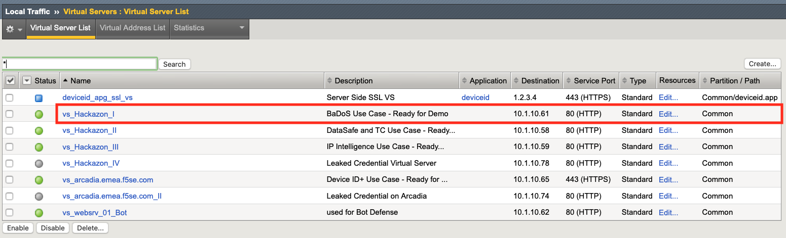
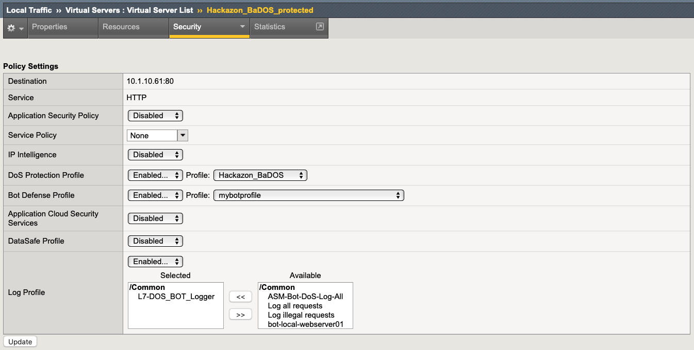

Module 2: Bot Detection Lab
*******************************

In this Lab we want to get familar with the Bot Detection Capabilities of AWAF. The goal is to create and apply a transparent Bot Defense Profile (signatures only) and enable logging for Bot requests.

.. important :: To only focus on Bot Defense, we will use the "Hackazon_BaDOS_protected" virtual server for this, because there is no WAF policy attached to it. If you wanna use a different VS, please make sure that there is no WAF policy active.

|

|
Create Logging Profile
*******************************

.. note :: The **"Hackazon_BaDOS_protected"** already has a Logging Profile attached to it, which can be used for this demo. In case there is no Logging Profile attached or you want to create your own profile for this demo, use the steps described below. 

#. Navigate to **Security > Event Logs > Logging Profiles** and create a new Logging Profile with the settings shown in the screenshot below (local publisher with all options enabled).
#. Give it a name and click **create**.

.. image:: ../pictures/module2/image02.png
    :width: 90%
|
Create Bot Defense Profile
*******************************

#. Navigate to **Security > Bot Defense > Bot Defense Profiles** and click **Create**.
#. Choose a name (e.g. mybotprofile) and set the Enforcement mode to **transparent**. Review the **Bot Mitigation Settings** and **Signature Enforcement**, but leave all settings on default for now (We will cover more options in **Class 2 / Module 1**).
#. Click **Save**

.. image:: ../pictures/module2/image03.png
    :width: 90%
|
Enable Bot Defense and Logging
*************************************

#. Navigate to **Local Traffic > Virtual Servers > Virtual Server List > Hackazon_BaDOS_protected**
#. Click on the **Security** Tab and click **Policies**.
#. Enable Bot Defense and Logging with the profiles created before.
#. Click **Update**

.. note :: Make sure there is either the existing Logging Profile: **L7-DOS_BOT_Logger** or the **new created** Logging Profile attached to this VS. 

|
Start generating Traffic
***************************

#. Open a ssh session to the Kali system.

   .. note :: To open a ssh session to UDF you need to provide your public key. For more information, please refer to the UDF documentation.

#. make sure you are in the directory:
   
   .. code-block:: sh

    /home/ec2-user
#. start generating traffic by using the script **"baseline_menu.sh"**:
   
   .. code-block:: sh

    sudo su
    screen + press ENTER
    ./baseline_menu.sh
    choose 1
    de-attach by clicking Ctrl+a+d
    screen
    ./baseline_menu.sh
    choose 2
    de-attach by clicking Ctrl+a+d
#. Activate both options:
   
   .. image:: ../pictures/module2/image05.png

   it should look like this:

   .. image:: ../pictures/module2/image06.png

#. Navigate to **Security > Event Logs > Bet Defense > Bot Traffic** and review the Dashboard. Click on the Hackazon_BaDOS_protected VS to see more details for this specific Application.

   .. image:: ../pictures/module2/image07.png
    :width: 90%
   .. note :: It may take some time before you can see some results.
#. Click on any Bot Categories to see detected Bots (per category)

   .. image:: ../pictures/module2/image08.png
    :width: 90%
#. Go back to the Start Dashboard ans click on "detected Bots" to see all.

   .. image:: ../pictures/module2/image09.png
    :width: 90%

Override settings and create execptions for specific bots 
**************************

.. note :: It may occur, that some Bots are detected as false positives and/or the false mitigation action will be applied. In this case, you can create exceptions to override the default settings per bot.

#. Navigate to **Security > Bot Defense > Bot Defense Profiles** and click **on the profile** (either your own or the preconfigured DOS_BOT_Logger profile). 
#. Click on **Bot Mitigation Setings**
#. On the Bottom, click on **Add Exception** 

   .. image:: ../pictures/module2/image10.png
    :width: 90%

   .. note :: The system automatically stores all seen bots (and based on signatures) sorted by classes and categories.

#. In the search field type in: **curl** to filter for this specific type, select curl (category: untrusted bot) and click add.
#. You now can define a specific action for curl, which overrides the global action for this category (untrusted bot). Exceptions are are on a per profile basis. Change the action to "block" and click "Save".
#. Open a Terminal Server Session to the "Windows Client System" and run the "01-Curl-Bot" batch-file, located on the Desktop.
#. Back in TMUI navigate to **Event Logs > Bot Defense > Bot Requests** verify the requests seen.

.. note :: As the baseline script is still running, it may be needed to search for a specific log entry. Click the filter icon and select "denied", to display only blocked requests.

Congratulations! You have just completed class 1 - module 2. 

See class 2 - module 1 for more advanced configuration.