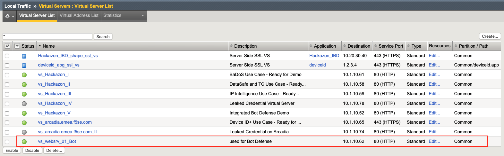
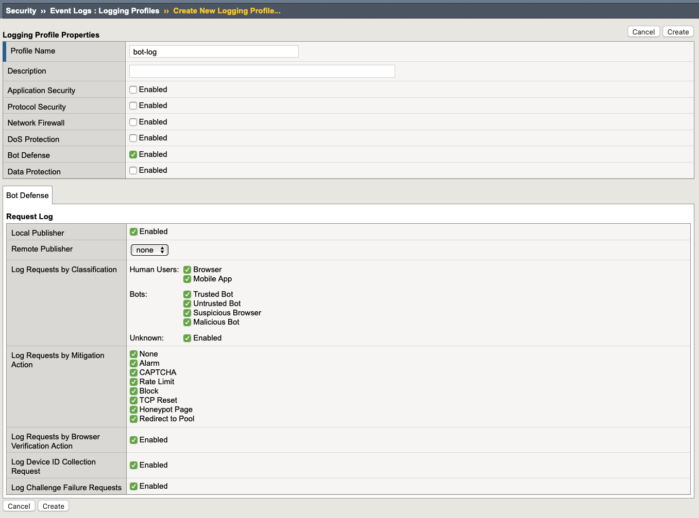

Module 1: Bot Mitigation Lab
*******************************

In this Lab we want to get familar with all the additional features avaialble for Bot Defense. The goal is to understand the difference between signature-based and JavaScript-based Detection capabilities and mitigation options.

.. important :: To only focus on Bot Defense, we will use the "vs_websrv_01_Bot" virtual server for this, because there is no WAF policy attached to it. If you wanna use a different VS, please make sure that there is no WAF policy active.

|

|
Create Logging Profile
*******************************

#. Navigate to **Security > Event Logs > Logging Profiles** and create a new Logging Profile with the settings shown in the screenshot below (local publisher with all options enabled).
#. Give it a name and click **create**.

|
Create Bot Defense Profile
*******************************

#. Navigate to **Security > Bot Defense > Bot Defense Profiles** and click **Create**.
#. Choose a name (e.g. mybotprofile) and set the Enforcement mode to **blocking**. 
    
    .. image:: ../pictures/module1/image04.png
        :width: 100%

#. Go to Mitigation Settings and change it as seen in the picture below. Leave all other settings as default.

    .. image:: ../pictures/module1/image05.png
        :width: 100%

#. Go to **Browsers** and make sure that **Browser Verification** and **Device ID Mode** are disabled (none). Leave all other settings as default.

    .. image:: ../pictures/module1/image13.png
        :width: 100%

#. Click **Save**

Enable Bot Defense and Logging
*************************************

#. Navigate to **Security > Overview** and select the "vs_websrv_01_Bot" Virtual Server
#. Click on **Attach** and select **Bot Defense Profile**.

    .. image:: ../pictures/module1/image06.png
        :width: 100%

#. Choose the profile you've just created and click **Attach**

    .. image:: ../pictures/module1/image07.png
        :width: 50%

#. Do the same for the **Logging Profile** and use the profile you've just created.

Create and review simple Bot-Requests
*************************************

We will use the "win-client" virtual machine provided by this deployment to create simple Bot-Requests.

#. Open the RDP session

    .. image:: ../pictures/module1/image08.png
        :width: 50%

#. Double-click on the "02-Simple-Bot-and-impersonating.bat" batch file located on the desktop. This will generate three different requests.

    .. image:: ../pictures/module1/image09.png
        :width: 70%

#. Go back to the TMUI and click on: **Security > Event Logs > Bot Defense > Bot Requests**

    .. image:: ../pictures/module1/image10.png
        :width: 90%

#. Review all (three) logs and see the "block" reason for each request. All requests where classified as malicious bots with the attempt to masquerade as a good bot (i.e. search bot).

    .. note :: All requests were made with curl and customized user agents to simulate different requests/attacks.

#. Go back to the Windows client and double-click on the "03-Simple-Bot-masked-as-Chrome-Browser.bat" batch file.

    .. image:: ../pictures/module1/image11.png
        :width: 80%

#. Go back to the Eventlog and review the result for this request. As you can see both requests were classified as a valid Browser and were allowed. Lets see how we can get more accurate results.
    
    .. note :: One request was made with curl and a customized user agent, but the other one was made with a headless chrome and a customized user agent to simulate different bots but masked as valid browsers. 

    
    .. image:: ../pictures/module1/image14.png
        :width: 100%

    .. image:: ../pictures/module1/image15.png
        :width: 100%

#. Go to **Security > Bot Defense > Bot Defense Profiles** and select our Bot Defense Profile (bot_websrv_01)

#. Within the profile go to **Browsers** and set "Browser Verification" to **Verify Before Access** and "Device ID Mode" to **Generate Before Access**.

    .. image:: ../pictures/module1/image16.png
        :width: 100%

#. Click **save** and go back to the Windows Client RDP Session.

#. Double-click again on the "03-Simple-Bot-masked-as-Chrome-Browser.bat" batch file and review the log entries in the TMUI.

#. As you can see, one request (made with curl) was classified as "suspicious Browser" and the status is "challenged". 

    .. image:: ../pictures/module1/image17.png
        :width: 100%

#. The second one (made with headless chrome and a customized user agent) was classified as "Browser" and also challenged. But this time the automated browser was able to solve the JS challenge and the request was allowed.

    .. image:: ../pictures/module1/image18.png
        :width: 100%

    .. image:: ../pictures/module1/image19.png
        :width: 100%

.. note :: This is not part of this LAB but it can be identified with the "CSHUI" part of Bot Defense (Client Side Human Intercation and Counting Anomalies"). It is based on ongoing checks, while the user browses through the application and is looking at HTML responses, for Mouse / Keyboard / Touch anomalies, Rapid surfing or session opening and many others. 

.. note :: Shape Solutions can provide the same and even more accurate results because of the more advanced JS and the AI based classification.