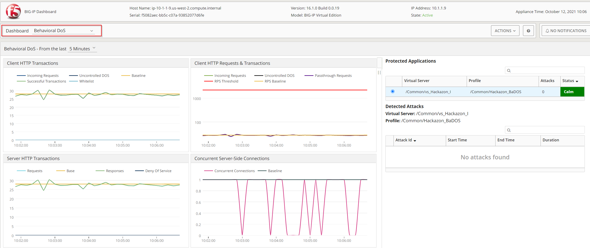
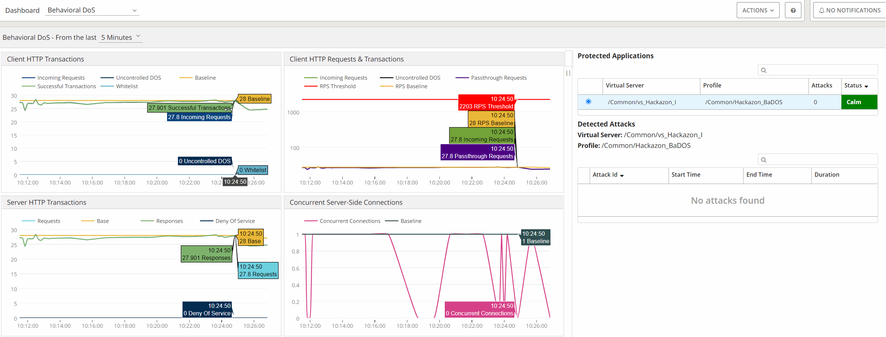
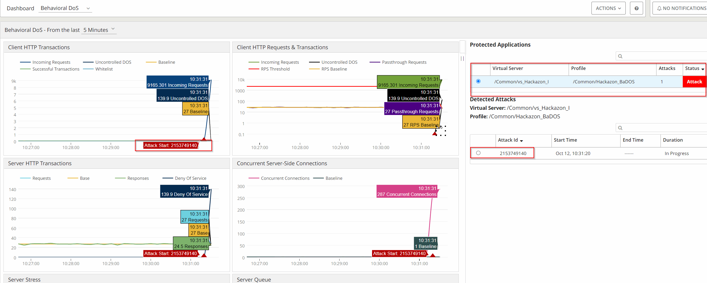

Module 2: Behavioral DOS (BADOS) Protection
###################################

F5's AWAF product include advanced functionality for defending L7DoS attacks.
While there are well described self-paced labs available on Clouddocs, the goal of this article is to focus on the Behavioral DOS Dashboard improvements, rather showing the Behavioral DOS Protection configuration.

.. note:: If you are intrested into the Behavioral DOS Protection configuration, please visit `Introduction to L7 Behavioral DoS`_.

.. _`Introduction to L7 Behavioral DoS` : https://clouddocs.f5.com/training/community/ddos/html/class7/class7.html

**Behavioral DOS Protection Overview**

With TMOS Release 14.1 a new enhanced BADOS (Layer 7 Behavioral DoS) Dashboard was introduced.
Use Case of the new Dashbaord: A customer would use this dashboard to get visibillity into Denial of Service attacks which are tracked and mitigated Behavioral DoS.

.. note:: The dashboard is reached via **Statistics > Dashboard and selecting Behavioral DoS** from the menu of dashboards.

The new dashboard provides:

* Client HTTP Transactions
* Client HTTP Requests & Transactions
* Server HTTP Transactions
* Concurrent Server-Side Connections
* Server Stress
* Server Queue
* TLS Handshake
* Connections Mitigation
* Layer 3-4 & SSL Mitigations
* HTTP Mitigation
* CPU - Utilization
* Memory - Utilization

The new Dashboard also provide the ability to:

* Zoom-in and Zoom-out
* Show legends of each chart, on placing mouse on any chart
* Custom time selection view

When an Attack is been recognized the new Dashbaord will provide details about:

* Status of the Protected Application - change from "Calm" to "Attack"
* Attack ID
* Information on the Server Stress Level
* Mitiagtion Action

