Module 2: Check how Device ID+ works
####################################

In this module, we will work with Device ID+ and get the identifier reported back into /var/ltm/log of BIG-IP.
Additional a BIG-IP reports into ELK Stack. So you can correlate data for anaylses.

.. warning:: This is not a full integration to show a Device ID+ / AWF Demo. Currently we are working on Use Cases which can be integrated into the Demo.

.. note:: We are currently working on a use case to leverage Device ID+ together with AWF and will update the Module accordingly. If you got a specific AWF "Device ID+ Usecase" in mind, please reach out to Patrick Zoller.

**Device ID+ Overview**

DeviceID+ is a pseudonymized identifier that can be used to identify a device visiting a customer's applications. 
More precisely, it is an identifier for a browser or a native mobile application. For the initial release of DeviceID+, we are only focusing on Web and Mobile Web applications.

.. note:: If you haven´t worked with Device ID+ before, please review the `Device ID+`_ Article on F5 Cloud Services.

.. _`Device ID+` : https://f5cloudservices.zendesk.com/hc/en-us/categories/360005886653-Device-ID-

**Check how Device ID+ works**

    #.  Connect to BIG-IP named "BIG-IP 16.0 generic demos and Device ID+" via TMUI.

        .. image:: ../pictures/module2/img_class3_module2_animated_1.gif
           :align: center
      
    #. Within the WebUI of the BIG-IP instances navigate to iApps › Application Services : Applications › deviceID and select `Reconfigure`.

        .. image:: ../pictures/module2/img_class3_module2_animated_2.gif
           :align: center
           :scale: 30%

    #. Within the iApp configuration you will find predefined JS Injection configuration in the `1JS` part. Furthermore the 1JS gets been injected on the Virtual Server named `arcadia.emea.f5se.com_vs`.
       We leave the rest of the configuration untouched. 

        .. image:: ../pictures/module2/img_class3_module2_animated_3.gif
           :align: center
           :scale: 30%

.. note::  F5 Cloud Services on `Getting Started with F5 Device ID+`_ cover the application onboard with F5 Device ID+ on BIG-IP in more detail.

.. _`Getting Started with F5 Device ID+` : https://f5cloudservices.zendesk.com/hc/en-us/articles/360060301673-Getting-Started-with-F5-Device-ID-

**Device ID+ and iRule**

Device ID+ includes two identifiers – a residue-based identifier and an attribute-based identifier. The residue-based identifier is based on local storage and cookies. 
The attribute-based identifier is based on signals collected on the device. The two identifiers always have different values.

1JS writes both the residue-based and attribute-based identifiers in a single, first-party cookie called *_imp_apg_r_*. The *_imp_apg_r_* cookie is URL encoded with the following format:

%7B%22diA%22%3A%22AT9cyV8AAAAAd60uXCtYafPTZGLaVAku%22%2C%22diB%22%3A%22ASJ4gFmzPo%2Fa8AHJceWhykudRoXeBGlP%22%7D

This cookie can be decoded via https://www.urldecoder.org/ to get the response in clear text. The decoded cookie has the following format:

.. code-block::

    "diA": "AT9cyV8AAAAAd60uXCtYafPTZGLaVAku"
    "diB": "ASJ4gFmzPo/a8AHJceWhykudRoXeBGlP"

.. note:: Here, diA represents the residue-based identifier and diB represents the attribute-based identifier.

**How to decode Device ID+ _imp_apg_r_ cookie with an iRule**

    #. Within BIG-IP we use an iRule named *print_deviceid* and do a URL decoding of the *_imp_apg_r_* cookie and log *diA* and *diB* into /var/log/ltm of BIG-IP.
    
    #. The irule named *print_deviceid* has been attached to Virtual Server named `arcadia.emea.f5se.com_vs`.

        .. image:: ../pictures/module2/img_class3_module2_animated_4.gif
           :align: center
           :scale: 30%
 
**How to test Device ID+**

    #. To verify and view the logged values, connect to BIG-IP named "BIG-IP 16.0 generic demos and Device ID+" via SSH. 
    #. Run *run util bash* followed by *tail -f /var/log/ltm* in the SSH Session.
    #. RDP to windows machine called *win-client*.
    #. Launch Chrome.
    #. Open Devtools (Keyboard F12), select XHR in the Devtools and select the Browser Tab named *Device ID check*.
    #. Check the request and response in Chrome.
    #. Also check the cookie on the Devtools under Application.

         .. image:: ../pictures/module2/img_class3_module2_animated_5.gif
           :align: center
           :scale: 30%

    #. You may want to do further test by running `Chrome`in Incognito Modus and compare the values of `diA` and `diB` with the outcome of the previous test.
    #. Also check *tail -f /var/log/ltm* in the SSH Session as the values of `diA` and `diB` of the *_imp_apg_r_* cookie have been written to the file.

        .. image:: ../pictures/module2/img_class3_module2_animated_6.gif
           :align: center
           :scale: 30%

**Device ID+ and ELK**

Within the UDF Environment you will find an instance called **ELK**.
Here we run an ELK Container which is used to visualize Device Identifier and correlate data i.e. Username to Device ID; Geo IP to Device ID.
Additional **AWF Unified Bot Protection** log events into ELK. Those logs been correlated as well.

.. note:: This is a MVP. So please reach out if you have use cases which we should add to the Demo.

Steps: 

    #. RDP to windows machine called *win-client*. The Password of the instance is listed within the **Details / Documentation** Tab.
    #. Launch Chrome and choose the bookmark called **Device ID+ Kibana**.
    #. Klick the Button left to "Home". Within the Kibana Section you can choose between **Discover** or **Dashboard**.
 
        .. image:: ../pictures/module2/img_class3_module2_animated_7.gif
           :align: center
           :scale: 30%

.. note:: Within the Dashboard you will find pre-configured Visualizations. The Dashboard has only a limited space in terms of sizing. In case you want to anaylses a specific Visualization, use the function called **Maximize Panel**.

        .. image:: ../pictures/module2/img_class3_module2_animated_7a.gif
            :align: center
            :scale: 30%

**Demo Use Cases - Single Device accessing unauthorized accounts**

Within here we will Demo sudden fluctuations in Users per DeviceID.

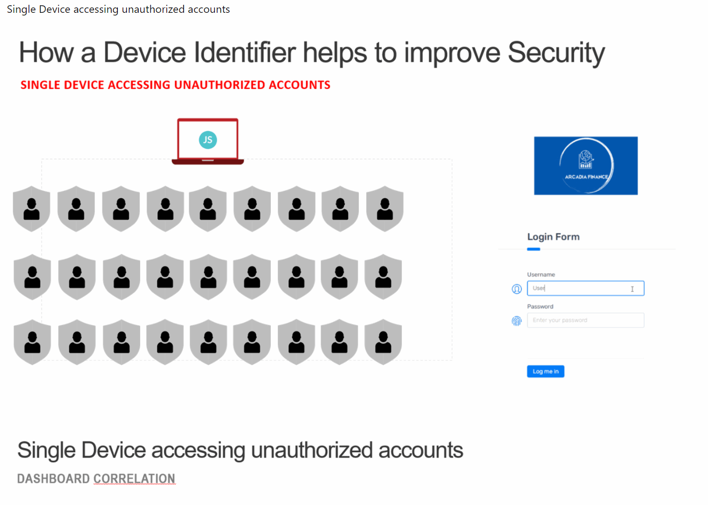

Steps:

    #. Launch Chrome and discover the browser and access the bookmark called **Device ID check**. This will launch the **Arcadia Application**.
    #. Navigate to the **Login** section of the Application.
    #. Try to login with different random Username.

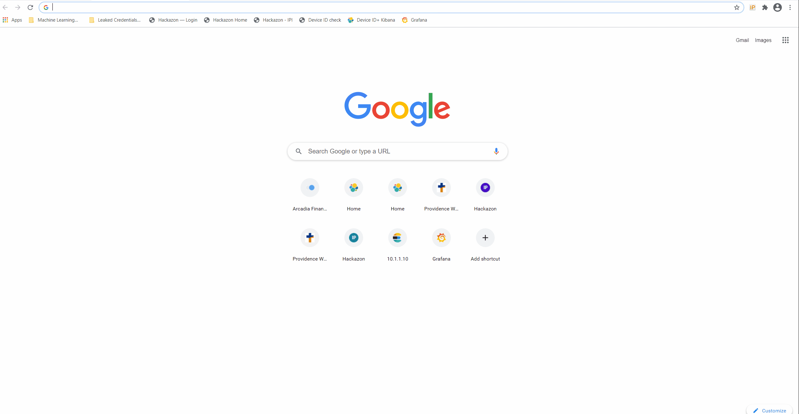

    #. Go back to **Device ID+ Kibana** and select **Dashboard**.
    #. Here you will see that a single Device (single **Device ID Type A** and **Type B**) tried to access the App with differnet Username.
  
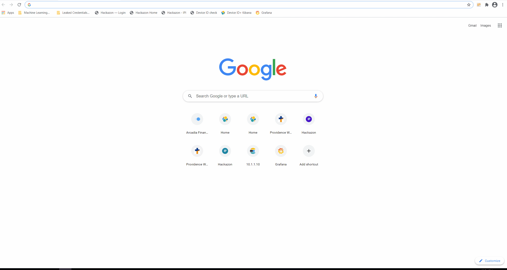

    #. If you like to Demo it with Postman, open **Postman**, start **New Runner Tab**  by navigating to the **File** Menu of Postman.
    #. From **Runner** drag the collection **Device ID+ ELK** into the Field **RUN ORDER**.
    #. Choose the Source Data File named **Demo_1.csv** by using the **select file** menu.
    #. Via **preview** check which Data we will Post via Runner to login page of **Arcadia Application**.
    #. Now Press **Run Device ID+ ELK** in Runner.
  

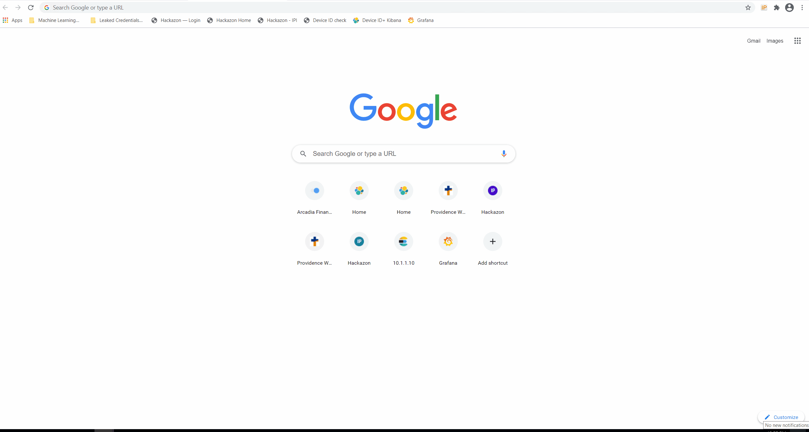

    
**Demo Use Cases - Deliberate use of proxy networks**

Within that use case you will cover a single Device accessing unauthorized accounts from different Source IPs.

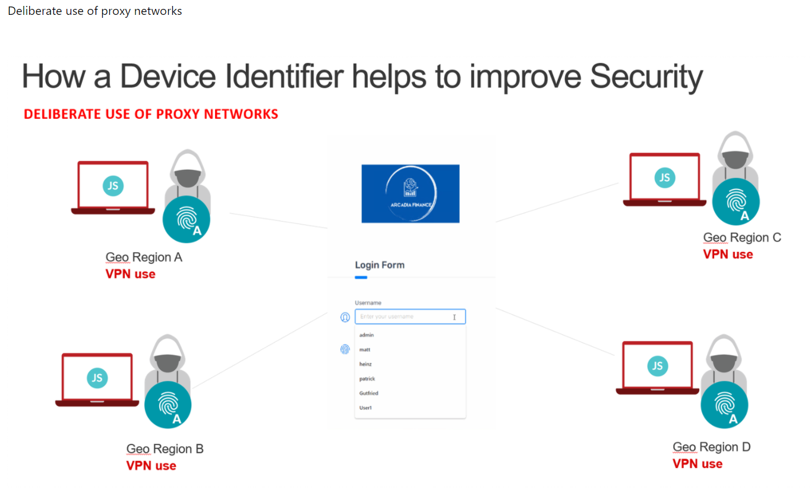

You will use Postman Runner to simulate 10 Request with 10 different Username using 10 different IPs but the same Device ID.

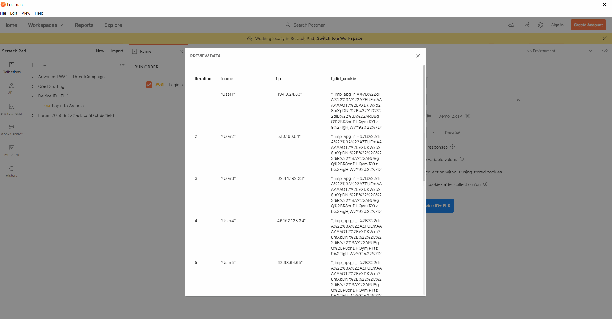

Steps:

	#. Open **Postman**, start **New Runner Tab**  by navigating to the **File** Menu of Postman.
    #. From **Runner** drag the collection **Device ID+ ELK** into the Field **RUN ORDER**.
    #. Choose the Source Data File named **Demo_2.csv** by using the **select file** menu.
    #. Via **preview** check which Data we will Post via Runner to login page of **Arcadia Application**.
    #. Now Press **Run Device ID+ ELK** in Runner.

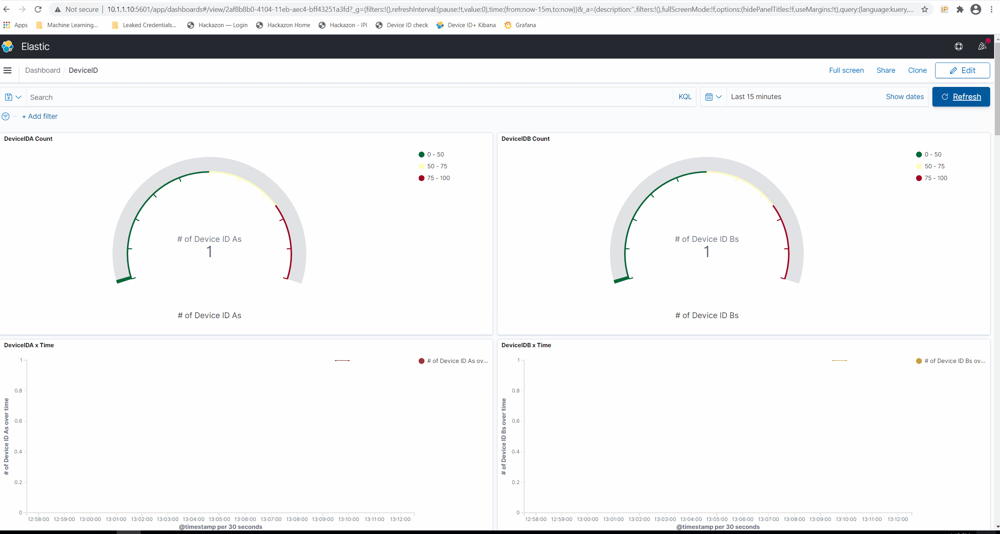

    #. Go back to your Kibana Dashboard.
    #. Within here you see again there is only one **Device ID Type A** / **Device ID Type B** identifier generated.
    #. The requests coming from 10 different geo locations.
    #. 10 Usernames have been used with one **Device ID Type A** / **Device ID Type B**  to logon to the page.

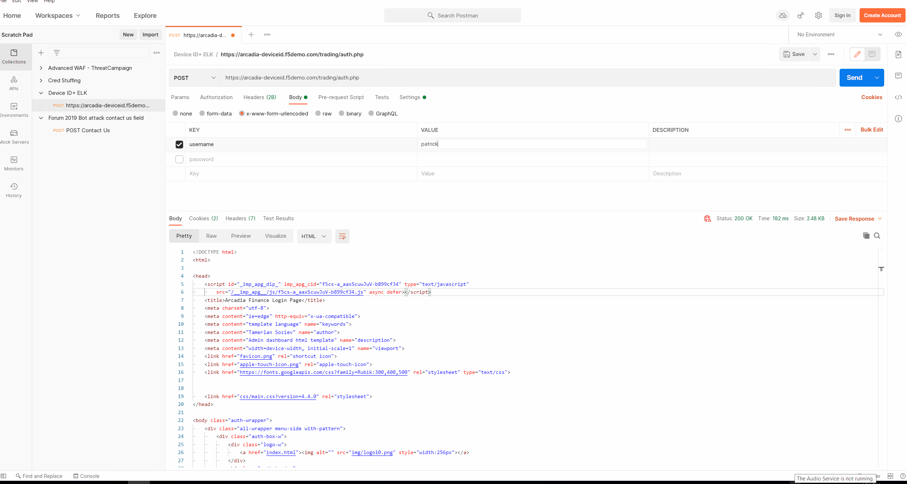

**Demo Use Cases - Unusual Devices accessing user accounts**

Within this Demo we will use Postman Runner to simulate requests coming from different devices sitting behind a proxy network.
The Source IP will be the same however, the **Device ID Type A** / **Device ID Type B** will change on the malicious request.
You´ll also see valid request coming from username **xyzgood**.
    
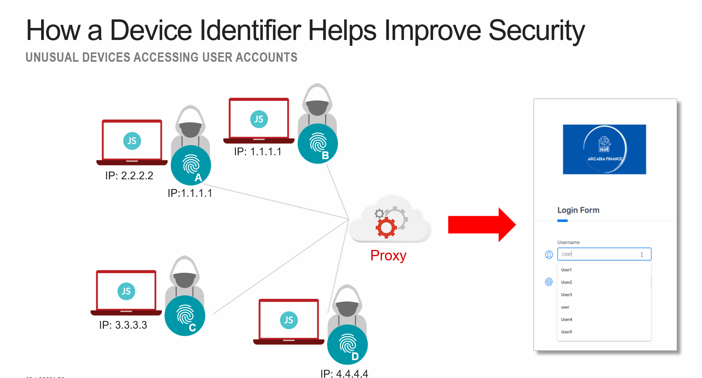
    
Steps:
    
    #. Open **Postman**, start **New Runner Tab**  by navigating to the **File** Menu of Postman.
    #. From **Runner** drag the collection **Device ID+ ELK** into the Field **RUN ORDER**.
    #. Choose the Source Data File named **Demo_3.csv** by using the **select file** menu.
    #. Via **preview** check which Data we will Post via Runner to login page of **Arcadia Application**.
    #. Now Press **Run Device ID+ ELK** in Runner.
    #. Go back to your Kibana Dashboard.
    #. Within here you see that various **Device ID Type A** / **Device ID Type B** have been generated by a single IP.
    
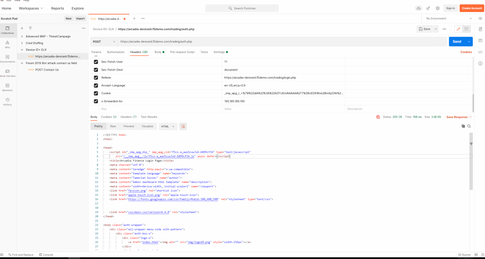

 #. If you invest further, you´ll see potential valid requets as these coming from a unique User by a Unique IP generating a single Device Identifier. 
 #. On the other hand you see differnt Device Identifier been generated by the same IP using random Usernames.
 
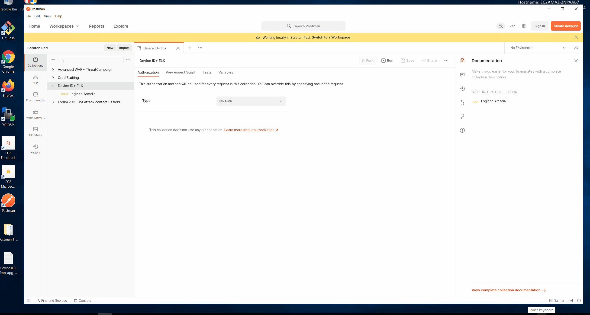